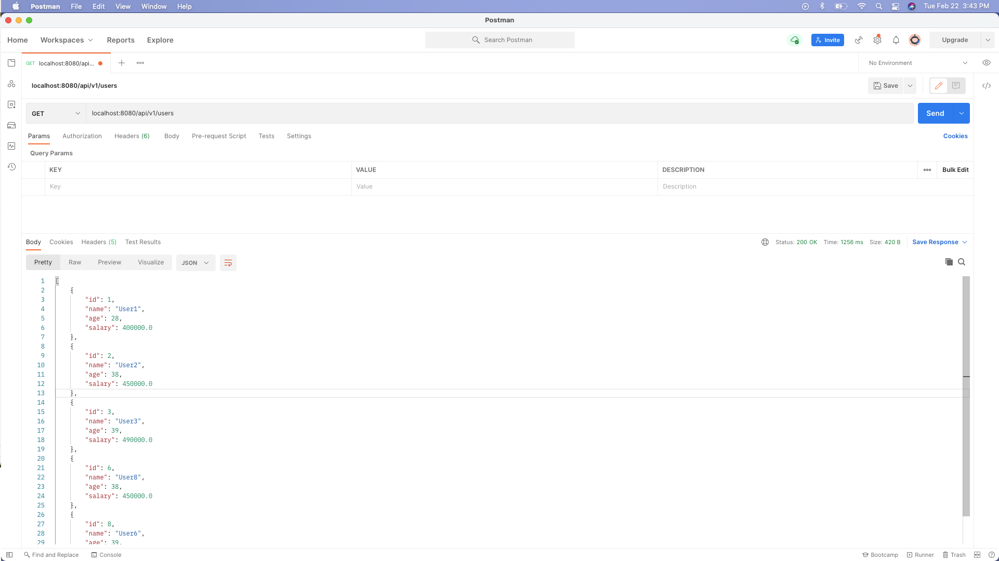

# How source code is created ? #
## 1. Entrypoint ##
```java
1. com.example.awsecsspringboot.AwsEcsSpringBootApplication 
        
package com.example.awsecsspringboot;

import org.springframework.boot.SpringApplication;
import org.springframework.boot.autoconfigure.SpringBootApplication;

@SpringBootApplication
public class AwsEcsSpringBootApplication {

    public static void main(String[] args) {
        SpringApplication.run(AwsEcsSpringBootApplication.class, args);
    }

}

```

## 2. Controller ##
```java
2. com.example.controller.UserController
package com.example.controller;

import com.example.exception.ResourceNotFoundException;
import com.example.modal.User;
import com.example.service.UserService;
import org.springframework.beans.factory.annotation.Autowired;
import org.springframework.http.HttpStatus;
import org.springframework.http.ResponseEntity;
import org.springframework.web.bind.annotation.GetMapping;
import org.springframework.web.bind.annotation.PathVariable;
import org.springframework.web.bind.annotation.RestController;

import java.util.List;

@RestController
public class UserController {

    @Autowired
    UserService userService;

    /*
        Input: No input
        Output: return 200, with json body
     */
    @GetMapping("/api/v1/users")
    public ResponseEntity<List<User>> findAllUsers() {
        List<User> users = userService.findAll();
        return ResponseEntity.ok(users);
    }

    /*
        Input: userId
        Output: return 200, with json body
     */
    @GetMapping("/api/v1/users/{userId}")
    public ResponseEntity<User> findUserById(@PathVariable int userId) {
        try {
            User user = userService.findById(userId);
            return ResponseEntity.ok(user);
        } catch (Exception ex) {
            return ResponseEntity.status(HttpStatus.NOT_FOUND).body(null); // return 404, with null body
        }
    }
}

```

## 3. Modal ##
```java
3. com.example.modal.User
        
package com.example.modal;

public class User {
    private int id;
    private String name;
    private int age;
    private float salary;

    public User(int id, String name, int age, float salary) {
        this.id = id;
        this.name = name;
        this.age = age;
        this.salary = salary;
    }

    public int getId() {
        return id;
    }

    public String getName() {
        return name;
    }

    public int getAge() {
        return age;
    }
    
    public float getSalary() {
        return salary;
    }
}

```

## 4. Service ##
```java
4.1 com.example.service.UserService
        package com.example.service;

import com.example.modal.User;
import org.springframework.http.ResponseEntity;

import java.util.List;

public interface UserService {
    public List<User> findAll();
    public User findById(int userId);

}
```

```java
4.2 com.example.service.UserServiceImpl 
 package com.example.service;

import com.example.modal.User;
import org.springframework.http.ResponseEntity;

import java.util.ArrayList;
import java.util.List;

public class UserServiceImpl implements  UserService{
    @Override
    public List<User> findAll() {
        List<User> usersList= new ArrayList<>();
        usersList.add(new User(1,"User1", 28, 400000));
        usersList.add(new User(2,"User2", 38, 450000));
        usersList.add(new User(3,"User3", 39, 490000));
        usersList.add(new User(6,"User8", 38, 450000));
        usersList.add(new User(8,"User6", 39, 490000));
        return usersList;
    }

    @Override
    public User findById(int userId) {
        return new User(1,"User1", 28, 400000);
    }
}
```
## 5. Exception ##
```java
5. com.example.exception.ResourceNotFoundException

package com.example.exception;

public class ResourceNotFoundException extends Exception{

    public ResourceNotFoundException() {
    }

    public ResourceNotFoundException(String message) {
        super(message);
    }

    public ResourceNotFoundException(String message, Throwable cause) {
        super(message, cause);
    }

    public ResourceNotFoundException(Throwable cause) {
        super(cause);
    }

    public ResourceNotFoundException(String message, Throwable cause, boolean enableSuppression, boolean writableStackTrace) {
        super(message, cause, enableSuppression, writableStackTrace);
    }
}

```

## 6. Test using Postman ##

